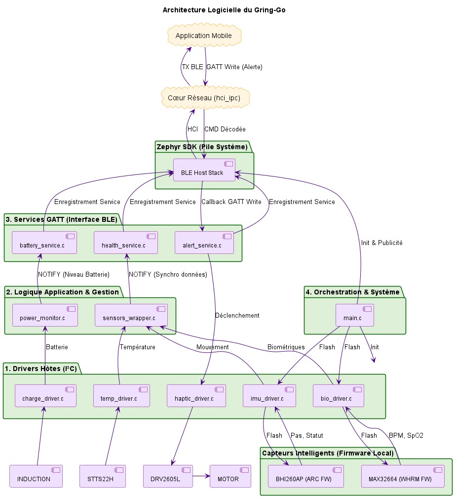
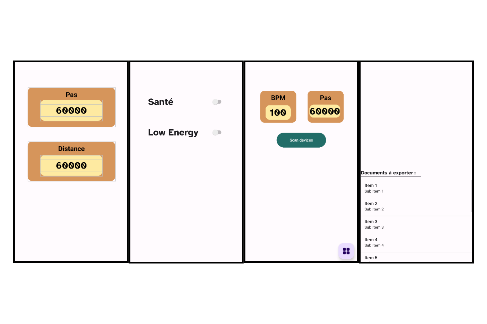

*Aperçu de l'avancement au 24 janvier 2026 de notre projet **GRING-GO**.*
## Organisation / documentation

Différents documents rédigés : 
- Cahier des charges
- Diagramme de Gantt (organisation + attribution des tâches)
*Vous pouvez retrouver 2 fichiers pdf : Gantt_Gring-go.pdf & Gantt_Gring-go-V2.pdf. La deuxième version incluant les retards.* 
- Répartition horaire

Suivi organisé : [Projet gring-go Github](https://github.com/Coloc-CORP/gring-go)
On retrouve sur ce git le développement entier séparé en différentes branches. L'utilisation des *Tasks*, pour répartir les tâches et avoir une vue d'ensemble de l'état d'avancement du projet.
## Electronique

### Conception des Cartes d'Évaluation Custom

Face à l'indisponibilité ou au coût prohibitif des kits d'évaluation constructeurs officiels, nous avons pris l'initiative de concevoir et produire nos propres solutions de test pour valider les briques technologiques critiques.

#### Conception et Prototypage
Deux cartes d'évaluation spécifiques ont été routées et fabriquées :
* **Module Power & Charge :** Dédié au **BQ25120A** pour valider la régulation du rail 3.0V (indispensable pour le nRF5340) et la gestion de la charge batterie.
* **Module Biométrique :** Support spécifique pour le **MAX32664** et son capteur optique associé, permettant de tester la qualité du signal brut avant l'intégration finale.

#### État de l'Avancement Hardware
* **Statut actuel :** Les circuits imprimés (PCB) et l'ensemble des composants ont été reçus.
* **Phase de Montage :** Nous entamons actuellement le soudage des composants CMS (Composants Montés en Surface).
* **Validation :** Une fois le soudage terminé, nous procéderons aux tests de mise sous tension et à la validation de la communication I2C avec le nRF5340 pour tester "en réel" les drivers précédemment développés.

### Étude de Consommation Théorique

En parallèle du développement, une étude de consommation a été réalisée pour valider la viabilité énergétique du produit.

* **Objectif :** Valider une autonomie approximative satisfaisante plutôt que de déterminer une valeur précise dès maintenant.
* **Résultats :** L'étude confirme une autonomie théorique d'environ **3 jours et demi** avec une utilisation normale (polling régulier des capteurs et notifications BLE avec vibration).
* **Validation :** Ce résultat valide les choix d'architecture (rail 3.0V optimisé et modes basse consommation des hubs de capteurs) et assure que le dispositif répond aux attentes qu'on a d'un "wearable".

### Système d'alimentation par induction

Nous avons réalisés une étude comparative sur les modes de transfert d'énergie sans fil, ce qui m'a conduit à valider une architecture basée sur la norme Qi.

#### Architecture système et choix des composants

L'objectif est d'intégrer un système complet dans un volume restreint (type bague connectée). Initialement, l'architecture retenue se décomposait ainsi:

- **Émetteur (Boîtier) :** Utilisation du **BQ500212A**, nécessitant un convertisseur Boost pour stabiliser l'alimentation 5V.
    
- **Récepteur (Bague) :** Le couple **BQ51003** et **BQ25120A** avait été choisi. Le BQ51003 gère la réception , tandis que le BQ25120A fait office de PMIC pour gérer le "Power Path".
    

Cependant, la conception d'un premier PCB pour ces composants spécifiques a révélé des contraintes de fabrication imprévues : la largeur nécessaire entre les vias était trop faible, rendant le coût de production du PCB prohibitif pour une phase de prototypage.

#### Adaptation pour la phase de test

Afin de valider le fonctionnement sans exploser le budget, j'ai modifié l'architecture pour cette version de test. Sur la partie bague, j'ai remplacé les composants initiaux par un récepteur **BQ51013** couplé à un chargeur **MCP73831T**.

Les cartes d'évaluation constructeur étant trop chères, j'ai conçu mon propre PCB de test sur **KiCad**. Le design est validé et permet de contourner les coûts élevés du premier prototype.

#### Conception hardware et dimensionnement

Le travail de conception s’est concentré sur l'optimisation de l'antenne et de la résonance :

- **Bobinage :** J'utilise du fil de cuivre de 0,22 mm. L'idée est de réaliser un montage type "fil de Litz" pour limiter l'effet de peau et maximiser le passage du courant à haute fréquence.
    
- **Accord de fréquence :** L’étape critique est le calcul des condensateurs de résonance $C_1$ et $C_2$ pour accorder l'antenne sur la fréquence cible de 100 kHz. L’ajout de feuilles de ferrite est également prévu pour canaliser le flux.
    

#### Prochains pas

Le PCB de test sur KiCad est réussi. Actuellement, je suis en attente de la réception des composants pour lancer l'assemblage. Pour effectuer les premiers essais de charge, j'ai également commandé une petite batterie LiPo, en sélectionnant le modèle le moins cher et le plus compact possible.

## Software

### Programmation embarqué

#### Développement embarqué NRF5340

Le développement logiciel repose sur le processeur **nRF5340** (Dual-core ARM Cortex-M33). L'architecture a été conçue pour être modulaire sous **Zephyr RTOS**, en respectant notre diagramme UML qui sépare strictement la gestion des périphériques de la logique applicative.

*Ce diagramme UML a été réalisé par l'écriture d'un code PlantUML.*

##### Travaux Réalisés : Couche Drivers
La phase de développement des drivers de bas niveau est désormais terminée. Ce travail a inclus :
* **Communication I2C & Comportement :** Écriture des drivers pour l'IMU (**BHI260AP**), le capteur biométrique (**MAX32664**), le capteur de température (**STTS22H**) et le gestionnaire de charge (**BQ25120A**).
* **Injection de Code (Sensor Fusion) :** Implémentation de la logique d'injection des données accélérométriques de l'IMU vers le capteur cardiaque pour la compensation de mouvement, garantissant la précision des mesures lors d'activités physiques.
* **Gestion de l'Énergie :** Configuration des registres pour optimiser l'autonomie (Deep Sleep, Ship Mode).
* ...

##### Prochaines Étapes : Intégration et Bluetooth
Le code est prêt pour la phase de tests réels sur les composants. La suite du développement portera sur :
* **Communication BLE :** Développement de la stack Bluetooth Low Energy.
* **Synchronisation Application :** Travail en collaboration avec **David** pour mapper les structures de données sur les services GATT afin d'assurer une communication fluide avec l'application mobile en cours de développement.

### Application Android

L'application Android est développé en JAVA sur Android Studio. 
Nous sommes passés sur une première phase de réflexion de l'architecture avec la définitions des différents *fragments* de l'application, c'est à dire les différentes fenêtres.

*Différents fragments créés 

Les fonctions de découverte Bluetooth à été mise en place. Le reste de la communication va se baser sur [Android-BLE-Library](https://github.com/NordicSemiconductor/Android-BLE-Library). 

Suite à l'appui du bouton *Scan Devices*, la liste d'appareils bluetooth apparaît et l'on peut choisir l'appareil bluetooth auquel s'appairer (le nrf5340). 

On retrouve une autre thématique qui est l'autorisation de permissions. 

## Retards (justification)

On retrouve de légers retards sur 2 points : 
- La partie hardware avec notamment l'alimentation boitier : celle-ci a pris du retard avec l’absence de composants.
- L'application Android est plus lente à développer que prévu car c'est un nouvel environnement sur lequel nous débutons. C'est pour cela que le temps d'adaptation n'est pas a négligé 
